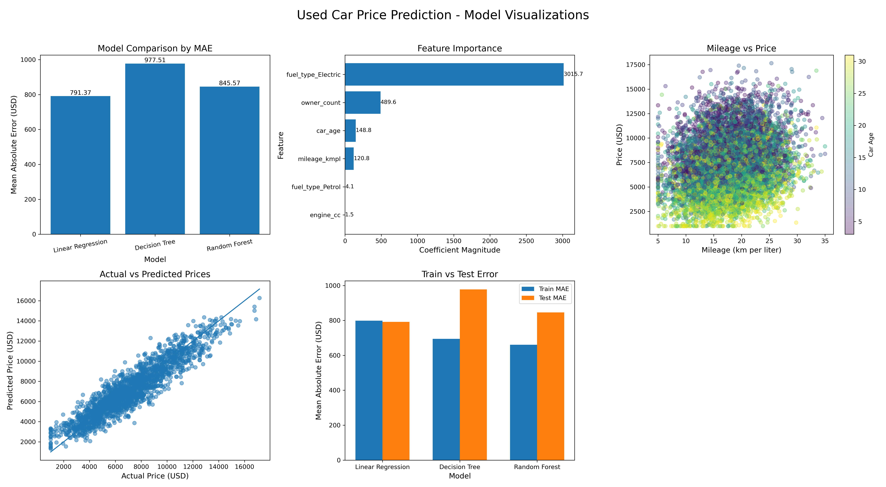

# Used Car Price ML

This project predicts used car prices using machine learning models.

## Models Used
- Linear Regression
- Decision Tree Regressor
- Random Forest Regressor

## Features Used
- mileage_kmpl
- engine_cc
- fuel_type
- owner_count
- car_age

## Dataset Location
data/used_car_price_dataset_extended.csv

## Results



## Install Required Libraries
```bash
pip install -r requirements.txt